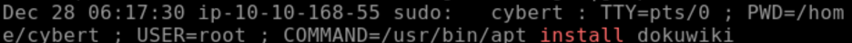
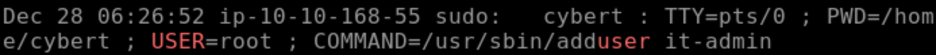
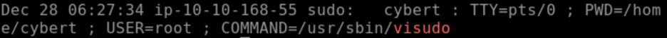
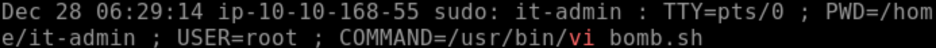
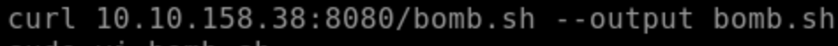
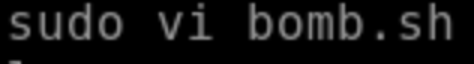
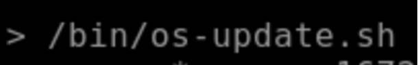
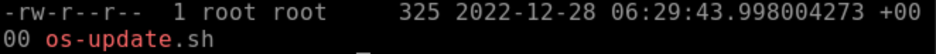
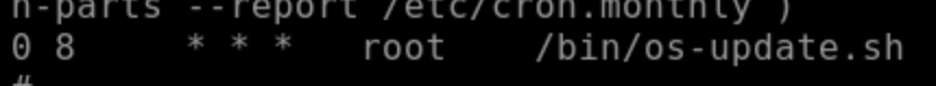

# DFIR Case Report – TryHackMe: Disgruntled

## 📌 Case Information
**Case Title:** Disgruntled 
**Platform:** TryHackMe  
**Analyst:** Fatima Z  
**Date:** 23 Dec, 2025  
**Objective:**  
Investigate suspected insider malicious activity and determine whether anything malicious was introduced into the system.

---

## 📝 Executive Summary
A disgruntled IT employee with elevated privileges abused administrative access to perform malicious activity.  
Analysis confirmed:
- Unauthorized user creation
- Privilege escalation manipulation attempts
- Deployment of a malicious script disguised as a system update
- Persistence configured via cron execution at **08:00 AM**

This activity represents an insider threat with intentional sabotage capability.

---

## 🧰 Investigation Scope & Evidence Sources
The following locations and artifacts were examined:

| Source | Purpose |
|--------|--------|
`/var/log/auth.log*` | Authentication + privilege evidence  
`/etc/sudoers` activity (via log) | Privilege escalation validation  
`/home/it-admin/.bash_history` | Command history review  
`/home/it-admin/.viminfo` | File access & editing history  
`/bin/` | Suspicious binaries/scripts search  
`/etc/crontab` | Persistence confirmation  
System timestamps | Execution & modification correlation  

**Primary Tools Used**
- Linux CLI (`cat`, `grep`, `ls`, `vi`)
- Log analysis
- Timeline correlation methodology

---

# 🔍 Detailed Investigation & Findings

---

## 1️⃣ Privilege Escalation & Unauthorized Install Activity
Log inspection revealed package installation being executed with sudo authority.

This indicates:
- The disgruntled IT user performed privileged installations
- Activity outside expected role duties
- Initial misuse of trust and privilege

---

## 2️⃣ Unauthorized User Creation Identified
Search confirmed a **new system user was created**.

This suggests:
- Attempt to maintain alternate access
- Persistence and future exploitation capability
- Insider threat behavior pattern

---

## 3️⃣ Suspicious Privilege Modification via visudo
Authentication logs revealed usage of **visudo**.

This implies direct tampering with sudo privileges — a significant red flag indicating deliberate privilege escalation.

---

## 4️⃣ Discovery of Malicious Script Attempt
Investigation into activity history revealed a script file accessed via `vi`.

This raised suspicion of:
- Payload creation
- Execution preparation
- System sabotage planning

---

## 5️⃣ Bash History Confirms Script Modification
Reviewing `.bash_history` confirmed modification events.

Findings showed:
- Script editing
- Functional manipulation
- Intentional persistence setup

---

## 6️⃣ viminfo Reveals File Rename and Relocation
`.viminfo` confirmed the malicious script was renamed to appear legitimate:

- Original: `bomb.sh`
- Renamed: `os-update.sh`
- Relocated to: `/bin`

This indicates:
- Obfuscation attempt
- Masquerading as trusted system update
- Increased likelihood of execution

---

## 7️⃣ Binary Directory Review Confirms Script Placement
Listing `/bin` verified the presence and timestamp consistency.

This confirms staged execution preparation.

---

## 8️⃣ Persistence Mechanism via Cron
Reviewing `/etc/crontab` confirmed scheduled execution.

Decoded cron timing:
- Executes at **08:00 AM**
- Recurring automated persistence trigger
- Guaranteed malicious execution timing

---

# 🕒 Timeline of Events
1️⃣ User performs unauthorized privileged installation  
2️⃣ New system user created  
3️⃣ visudo executed to manipulate privileges  
4️⃣ Script “bomb.sh” created and edited  
5️⃣ Script renamed → `os-update.sh`  
6️⃣ Script moved to `/bin`  
7️⃣ Cron configured  
8️⃣ Persistence established (08:00 AM daily)

---

# ✅ Conclusion
The disgruntled IT employee intentionally:
- Abused administrative privileges
- Created unauthorized system access
- Developed and disguised a malicious script
- Placed it in `/bin`
- Scheduled automated execution via cron

This constitutes a deliberate insider attack with persistence.

**Case Confirmed: Malicious Insider with Active Persistence Mechanism**

---

# 🔐 Security Recommendations
To mitigate and prevent recurrence:

### 🛡️ Access & Privilege Controls
- Restrict sudo privileges to minimal trusted accounts
- Implement strict RBAC
- Monitor visudo execution alerts

### 📝 Logging & Monitoring
- Centralize logs (SIEM)
- Enable alerts on:
  - new user creation
  - cron modifications
  - /bin directory changes

### 🔒 Persistence Mitigation
- Lock down `/bin` modification permissions
- Monitor cron execution activity
- Enforce code signing policies

### 👤 Insider Threat Policy
- Enforce HR departure IT controls
- Credential revocation procedures
- Continuous behavioral monitoring

---

## 📎 Evidence Folder
All screenshots supporting findings are located in the `evidence/` directory.
