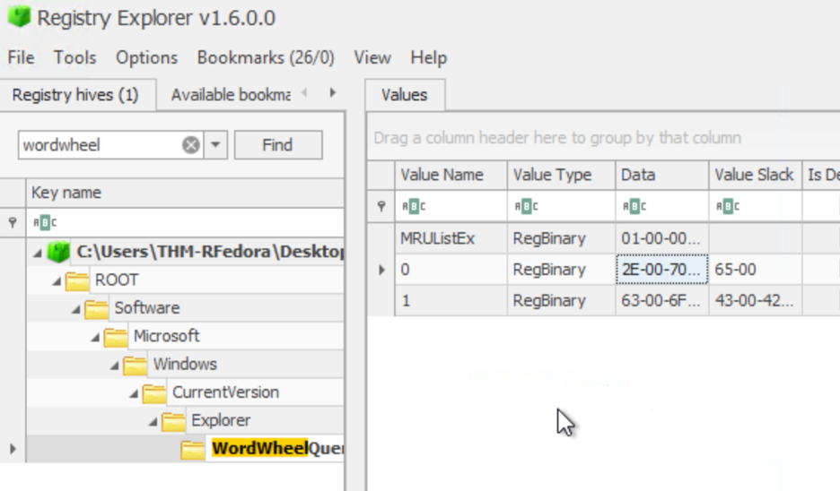
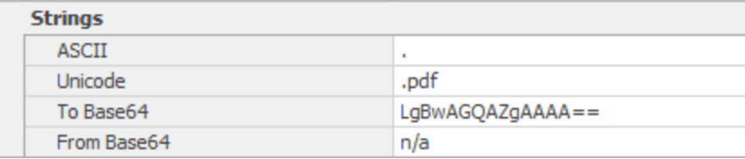
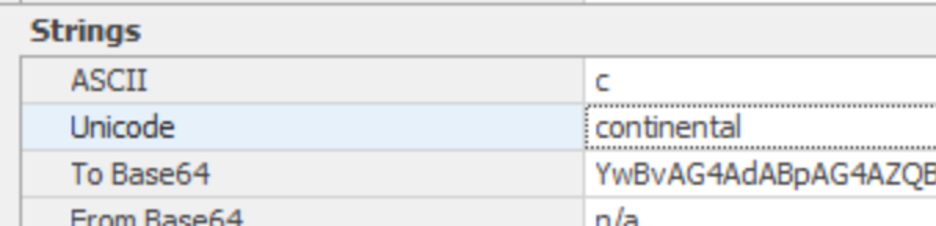
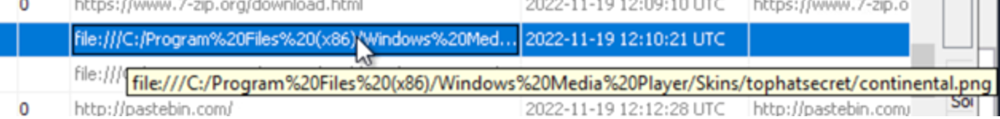
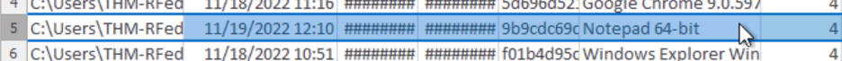
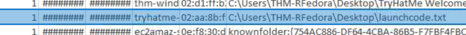

# DFIR Investigation Report — TryHackMe “Unattended”

## Case Information
**Case Title:** Unattended 
**Platform:** TryHackMe  
**Analyst:** Fatima Z.
**Date of Incident:** 19 November 2022  
**Investigation Window:** 12:05 PM – 12:45 PM
**Date of Investigation:** 27 Dec, 2025  
**Objective:**  
Investigate weather data exfiltration took place during the time window, user was away.

---

## Executive Summary
An investigation was conducted to determine whether the workstation experienced malicious or unauthorized user activity while the owner was away between **12:05 PM and 12:45 PM**. Forensic analysis confirms that an unknown individual accessed the system, specifically searched for sensitive files, located relevant material, and successfully exfiltrated content externally using a browser-based method.

The threat actor demonstrated prior knowledge of the target data, indicating deliberate intent and purposeful data theft.

**Outcome:** Data exfiltration confirmed  
**Attribution:** Unknown individual with physical access  
**Impact:** Exposure of confidential data

---

## Investigation Scope & Evidence Sources

The following locations and forensic artifacts were examined to determine activity during the period of user absence:

| Source / Artifact | Purpose |
|------------------|--------|
`NTUSER.DAT\Software\Microsoft\Windows\CurrentVersion\Explorer\WordWheelQuery` | Validate Windows Explorer search history & keywords used  
WebCache / Browser History | Identify browsing activity, access to external services, and timeline validation  
Downloaded Files / Web Artifacts | Confirm whether any files were retrieved or interacted with online  
Jump Lists (`AutomaticDestinations`) | Validate recently accessed files and applications  
Timeline Correlation (File + Web) | Establish sequence of user actions during investigation window  
System Interaction Artifacts | Confirm local file interaction and intent behind searches  

**Primary Tools Used**
- Registry Explorer  
- Autopsy  
- JLECmd.exe  
- EZViewer  
- Timeline correlation methodology  

---

# Detailed Investigation & Findings

---

### (1) Windows Search Evidence

Registry analysis of:

```
NTUSER.DAT\Software\Microsoft\Windows\CurrentVersion\Explorer\WordWheelQuery
```

showed (using Registry Explorer:

- Search for `".pdf"`  
- Search for `"continental"`







This indicates a targeted file search rather than general browsing or random use.

---

### (2) Browser History & WebCache

Browser WebCache and history artifacts showed activity within the timeframe of interest using Autopsy, with access to content matching the keyword “continental” and related image files (PNG). This aligns with intentional reconnaissance of the filesystem and related content.



---

### (3) Jump List Evidence

Using JLECmd.exe, Jump List artifacts were extracted and reviewed. These confirmed:

- Relevant documents were opened
- Open timestamps matched the investigation window





This supports active file interaction.

---

### (4) Exfiltration Confirmation

Analysis of browser history and web artifacts athe mentioned time stamp revealed:

- Access to **pastebin.com**  
- No evidence of physical data transfer devices (USB)  
- No network share usage


The target documents were uploaded externally, confirming exfiltration via a web upload mechanism.

---

## Timeline Summary (12:05 PM – 12:45 PM)

1) User away
2) Unauthorized individual gains access
3) Searches for PDF files
4) Uses keyword **“continental”**
5) Locates relevant documents
6) Reviews related media
7) Uploads sensitive contents to **Pastebin**
8) Leaves no attributable identity traces

---

## Indicators of Compromise (IOC)

| Category | Indicator |
|--------|---------|
Search | “.pdf” search keyword  
Search | “continental” keyword  
Exfiltration | pastebin.com activity  
Behavior | Targeted file searches and access  

---

## Conclusion
The forensic investigation confirms:

- Unauthorized access occurred  
- The individual intentionally searched for specific sensitive files  
- Target files were accessed  
- Data was successfully exfiltrated to an external service (Pastebin)  
- Threat actor identity remains unknown

This was a successful in-person data theft incident involving deliberate malicious intent.

---

## Recommendations
- Enforce automatic workstation lock
- Deploy Data Loss Prevention (DLP) controls
- Block public paste and anonymous sharing platforms
- Monitor browser upload behavior
- Enhance security awareness and physical workstation controls

---

## Appendix
All screenshots supporting findings are located in the `evidence/` directory.
